# NConfigurator

Setup, calibration, tuning and diagnostics for **ArduPilot** and **PX4** flight controllers, on Windows.

From a new flight controller to the first flight in one app:

- **Flash firmware**, with warnings for beta / dev builds and unofficial boards.
- **Set up step by step** in the Setup Wizard: frame or airframe, calibrations, flight modes, switches (arm, emergency stop…), failsafes, batteries, initial tune, motors, ESCs, LEDs and buzzer.
- **Calibrate** with guided wizards and a live 3D vehicle: accelerometer (saves each side by itself), compass (with failure reasons and quality grades), radio (stick ends, then every other channel), ESCs, IMU temperature, CompassMot.
- **Find motor-order mistakes:** identify each motor output on the frame; servo outputs are never spun.
- **Check health:** sensors side by side, CPU / memory / internal errors, calibration quality.
- **Review logs:** event timeline with explanations, vibration, motors and eRPM, hover vs battery, PID estimate, replay, comparing two logs.
- **Plan on the map:** missions, geofence, return-to-launch, flight-restriction zones and offline maps.
- **Practise with a simulator.**

**New in 0.2.0-beta.6:** see the [changelog](CHANGELOG.md) and the [tester feedback on beta.5](docs/beta5-tester-feedback.md) with what was fixed.

> **Pre-release (beta).** NConfigurator was developed with AI assistance (Anthropic Claude) and is still being tested. It hasn't been tested on every flight controller, firmware and vehicle type. **Remove the propellers** when configuring and check every setting before flying.

## Download

**[Releases page](https://github.com/naspaw/NConfigurator/releases)**: pick the newest version

| File | Use |
|---|---|
| `NConfigurator-Setup-<version>.exe` | Installer (English / Turkish), adds a Start-menu shortcut |
| `NConfigurator-<version>-portable.exe` | Runs without installation, e.g. from a USB stick |

**Requirements:** Windows 10 or 11 (64-bit). A USB data cable for the flight controller. An internet connection is only needed for firmware downloads, maps and the Lua script library.

Windows SmartScreen may warn about an unknown publisher, because the app isn't code-signed yet. Choose **More info → Run anyway**.

## Screenshots

| | |
|---|---|
| 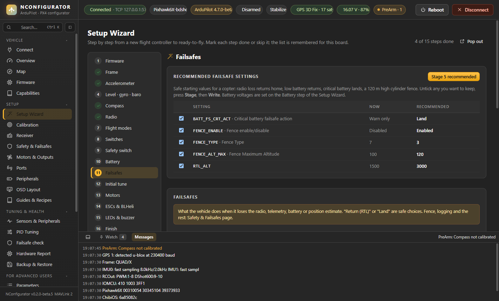 **Setup Wizard** with Mark done / Skip and recommended failsafes | 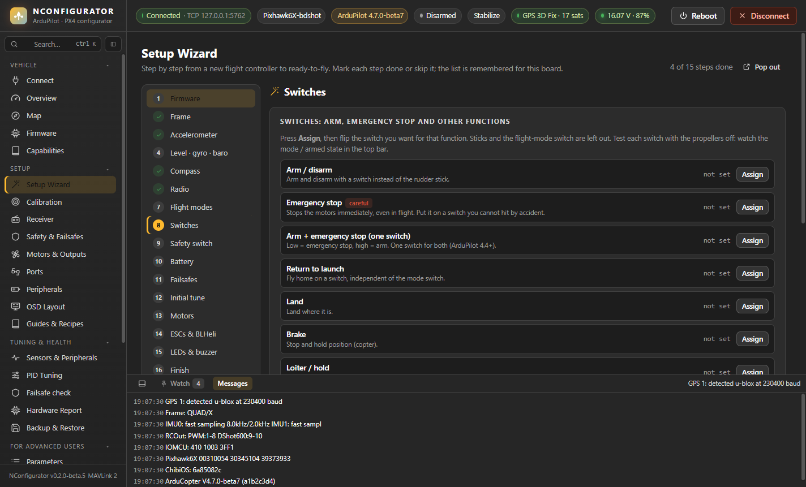 **Switches:** arm, emergency stop and more, by flipping the switch |
| 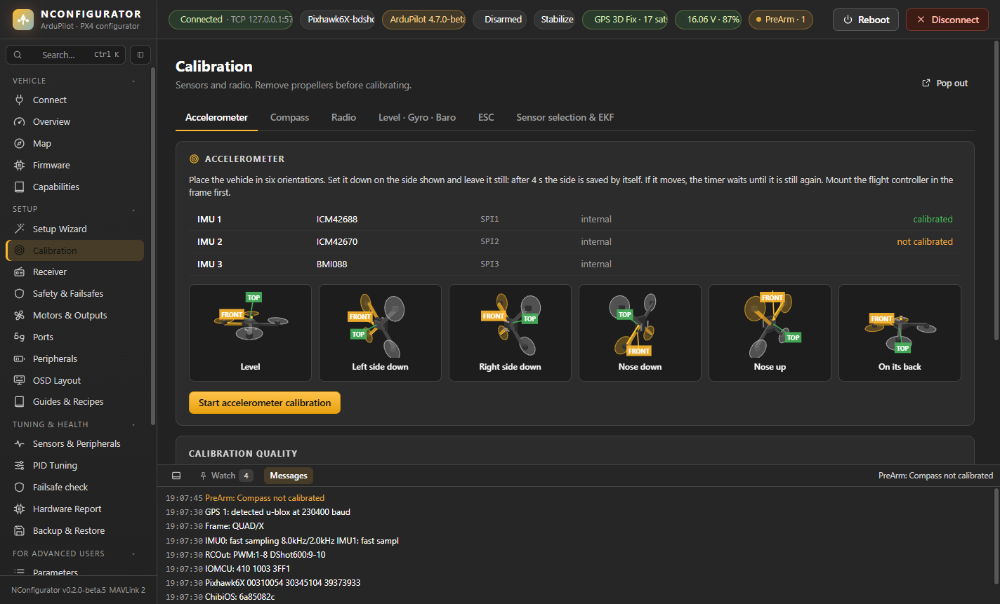 **Accelerometer calibration** with 3D side tiles | 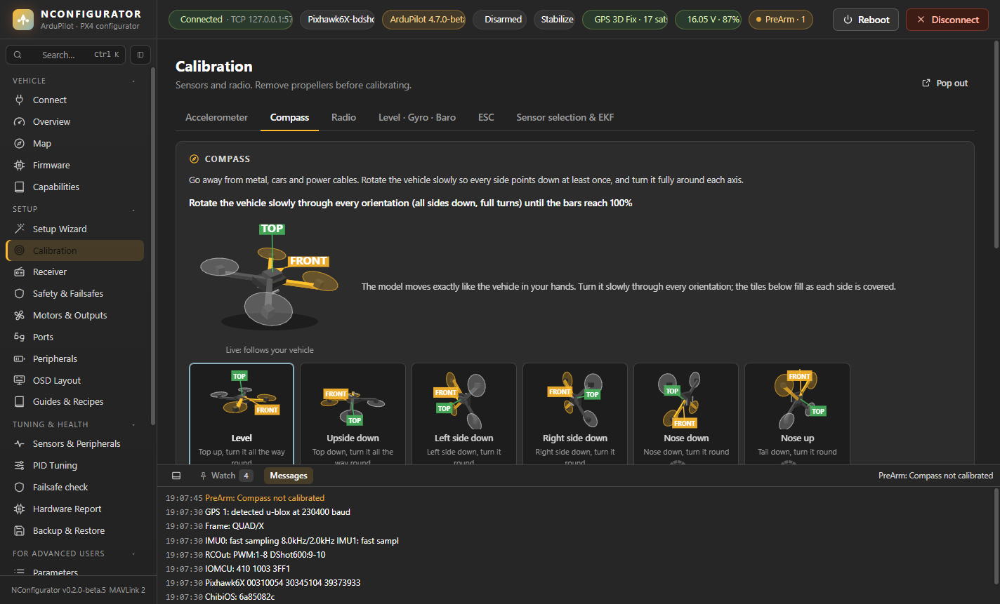 **Compass calibration** with a live 3D vehicle |
| 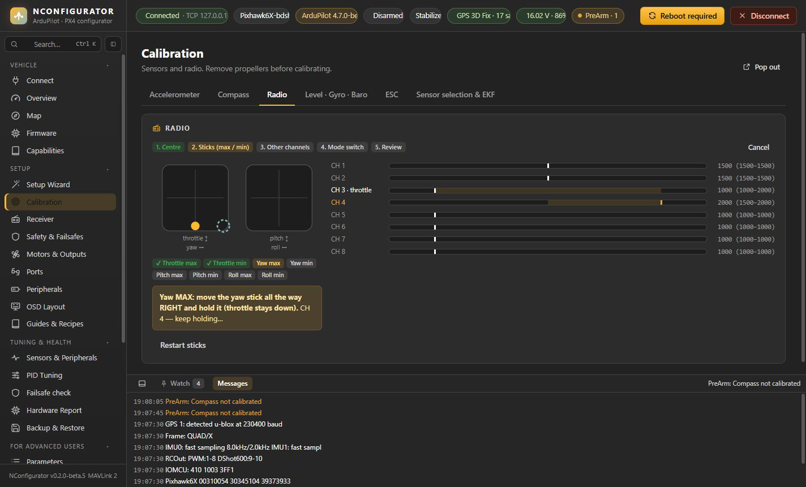 **Radio calibration** by stick ends | 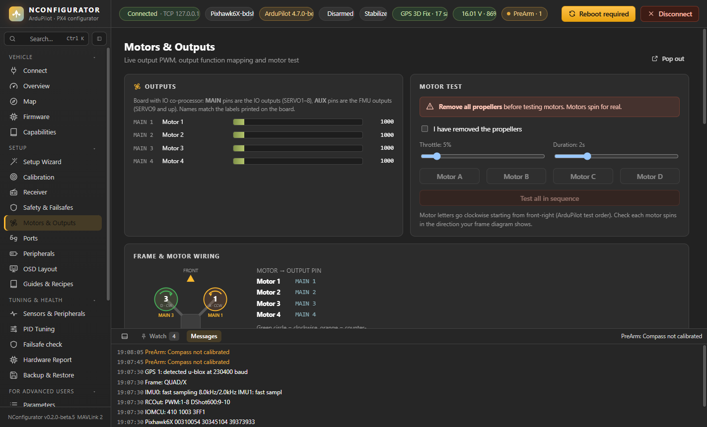 **Motors & Outputs:** MAIN / AUX names, identify motors |
| 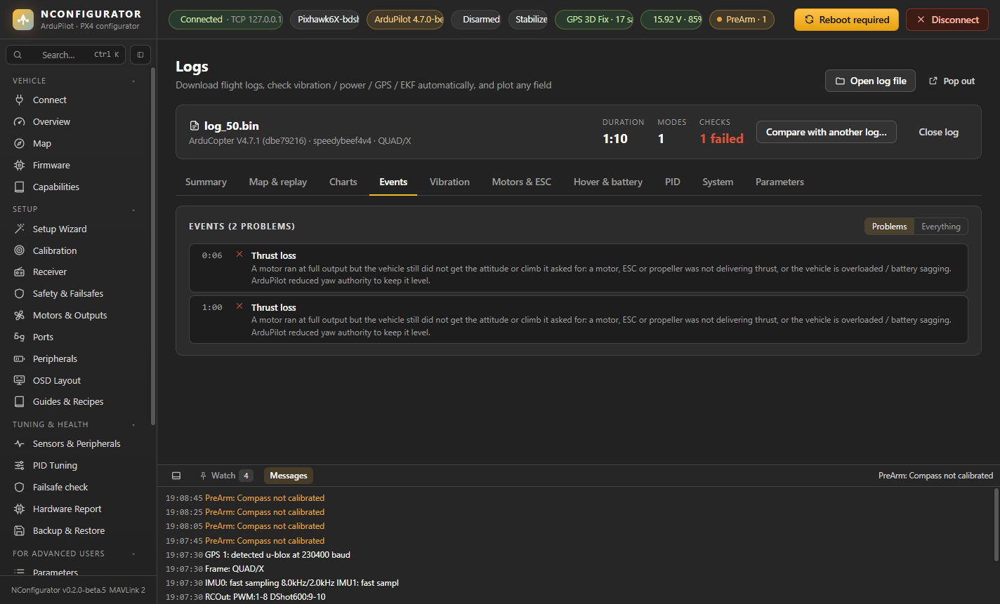 **Log events** explained, with times | 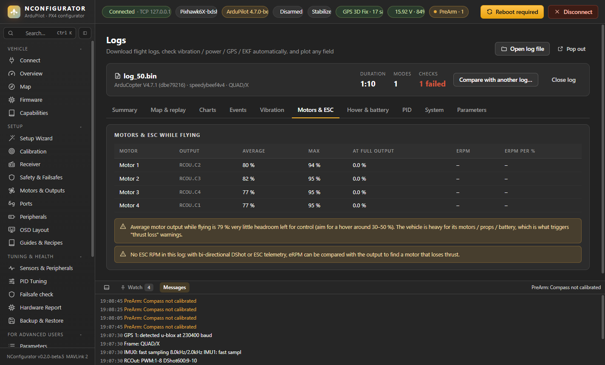 **Log: motors & headroom** |
| 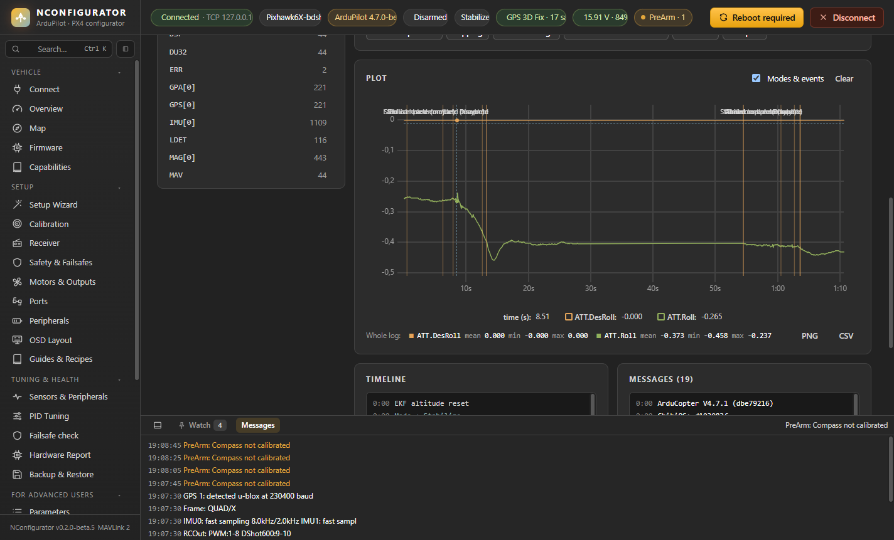 **Log replay:** 3D attitude and sticks at the cursor |  **Map:** mission, fence, home |
| 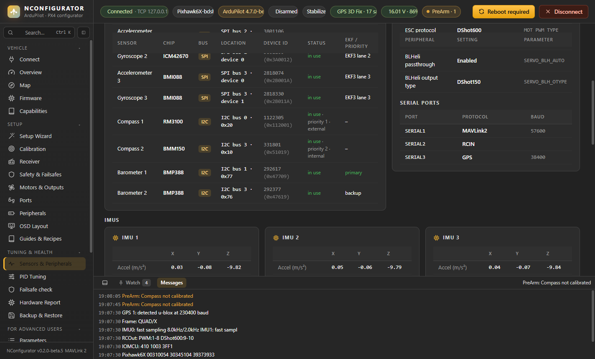 **Sensors & system health** | 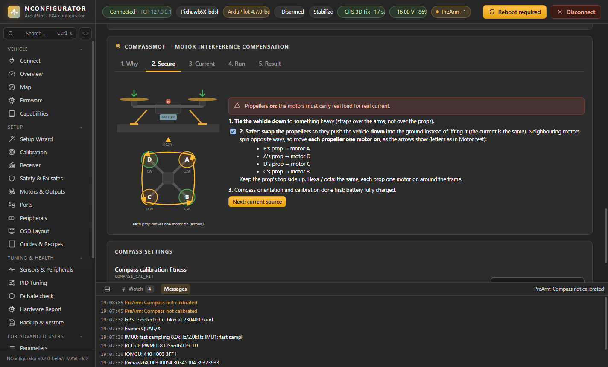 **Guided CompassMot** |
| 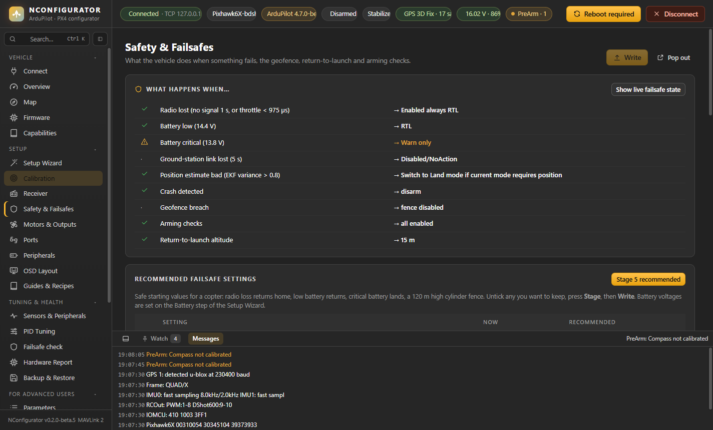 **Safety & Failsafes** | 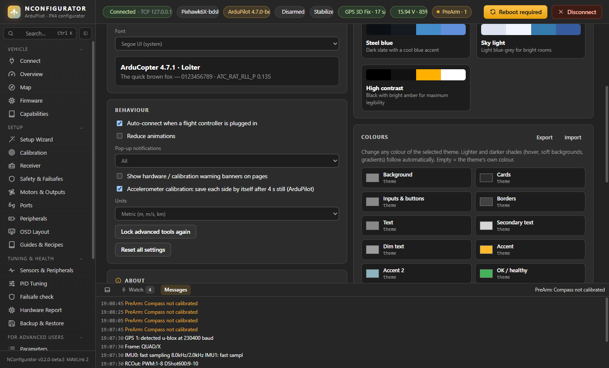 **Themes and colour editor** |
|  **MAVLink Inspector** live plots |  **Ctrl+K search** |

## Quick start

1. Install and start NConfigurator.
2. Plug in the flight controller over USB. It connects automatically (**Auto-connect** in the top bar).
3. Read the yellow banners: they list missing sensors and calibrations after a first boot or a reset.
4. New vehicle: **Setup → Setup Wizard**. Existing vehicle: **Tuning & Health → Backup & Restore** first.

## User manual

| Chapter | Covers |
|---|---|
| [Getting started](docs/README.md) | Installation, first connection, safety rules |
| [Working with the app](docs/00-working-with-the-app.md) | Layout, Ctrl+K search, inspection dock, warnings, saving changes |
| [Vehicle](docs/01-vehicle.md) | Connect, Overview, Capabilities, MAVLink Inspector, Messages, Map (missions, fence, zones, offline maps), Firmware |
| [Setup](docs/02-setup.md) | Setup Wizard; calibration (accelerometer, compass, radio, level / gyro / baro, ESC, sensor selection & EKF); Receiver; Safety & Failsafes; Motors & Outputs; Ports; Peripherals; Guides & Recipes; OSD Layout |
| [Tuning & Health](docs/03-tuning-and-health.md) | Sensors & Peripherals, PID Tuning, Hardware Report, Backup & Restore, and Mag Tools, Parameters, Logs |
| [For Advanced Users & App](docs/04-tools.md) | Filters & Notch, Scripts & Files, Simulation (SITL / HITL / SIH), Settings |
| [Tester feedback on beta.5](docs/beta5-tester-feedback.md) | Every problem reported on beta.5 (Pixhawk 6C mini, Lectron Pi5 H7) and what changed |
| [Tester feedback on beta.4](docs/beta4-tester-feedback.md) | Every problem reported on beta.4 (Pixhawk 6X, 6C mini) and what changed |
| [Tester feedback on beta.3](docs/beta3-tester-feedback.md) | Every problem reported on beta.3 (Pixhawk 6X, Lectron Pi5 H7) and what changed |
| [Tester feedback on beta.2](docs/beta2-tester-feedback.md) | Every problem reported on the first version and what changed |
| [Troubleshooting](docs/05-troubleshooting.md) | What each warning means and how to fix it |

## Supported

- **Firmware:** ArduPilot (Copter, Plane, Rover, Sub, Heli) and PX4 (multicopter first).
- **Boards:** any ArduPilot or PX4 board with a bootloader. Tested so far on a SpeedyBee F405 V4 (ArduPilot 4.7.1 and PX4 1.17), and in simulation with Pixhawk 6X / 6C and Matek H743 sensor sets. Mission upload, motor identify, ESC calibration and the PX4 airframe change are so far tested on the virtual vehicle only.
- **Connections:** USB, telemetry radio (serial), UDP and TCP (including simulators).
- **Language:** English and Turkish.

## Feedback

Found a bug or a wrong value? Open an [issue](https://github.com/naspaw/NConfigurator/issues). Please include:

- the board
- the firmware and version
- what you did and what happened
- if possible, the Hardware Report (**Tuning & Health → Hardware Report → Export**) or a log file

## Licence

MIT — see [LICENSE](LICENSE). NConfigurator is an independent project and isn't affiliated with ArduPilot, PX4, Dronecode or MicoAir. ArduPilot and PX4 are projects and trademarks of their respective owners.
