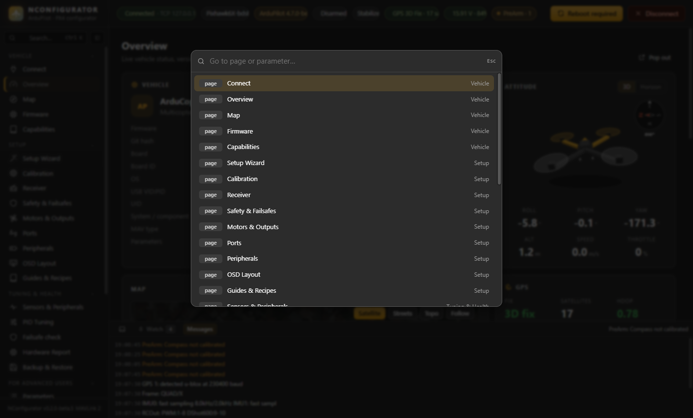

# Working with the app

## Screen layout

- **Sidebar (left).** Pages are grouped into **Vehicle** (also Messages, MAVLink Inspector, Firmware, Backup & Restore), **Setup**, **Tuning & Health**, **For Advanced Users** (Parameters, Filters & Notch, Mag Tools, Logs, MAVLink Console, Scripts & Files, Simulation) and **App** (settings).
  - Click a group title to fold it.
  - The button next to the search box collapses the sidebar to icons only.
  - A yellow dot next to a page means settings on that page changed since the vehicle booted.
- **Top bar.** Shows the connection, the board maker / name, the firmware version (amber for beta and dev builds), armed state, flight mode, GPS and battery.
  - The battery chip turns yellow or red below the low or critical battery voltage, even when the percentage still looks fine.
  - **PreArm · N** collects the reasons the vehicle refuses to arm; click it for the list.
- **Inspection dock (bottom).** Visible on every page; toggle it with **Ctrl+J**.
  - **Watch** shows pinned values with a 30-second mini graph and their min/max.
  - **Messages** shows the latest vehicle messages.

- **Pop out** (top right of every page) opens the page in its own window, for example the MAVLink Inspector or a chart on a second screen. It stays live; close the window to bring the page back.

## Quick search — Ctrl+F (or Ctrl+K)

Press **Ctrl+F (or Ctrl+K)** (or click **Search…**) and type:

- a page name, e.g. `safety` or `osd`, or
- a parameter name, title or description, e.g. `RTL_ALT`, `fence`, `battery capacity`.

Choose a parameter to open it on the Parameters page with its description and allowed values.

## Pinning values to the dock

- **MAVLink Inspector:** press the pin button next to any field, e.g. `ATTITUDE.roll` or `VFR_HUD.throttle`.
- **Parameters:** press **Pin** in the details panel to watch a parameter.
- **Dock:** type `MSG.field` or a parameter name in the box and press **Pin**.

Pins are remembered between sessions. A typical use is to change a setting on one page while watching its effect in the dock.

## Banners and warnings

| Colour | Meaning |
|---|---|
| Yellow banner at the top of a page | Something needs attention before flying, e.g. a sensor not detected, a calibration missing or an unhealthy sensor. Most have a button such as **Reboot**, **Calibrate** or **Setup Wizard**. |
| Yellow "changed since boot" box | Lists the settings on this page you changed during this power-up, with **Revert to boot values**. |
| Red text | A value outside safe limits, or a check that will block arming. |

Close a banner with **×** to hide it for the session, or turn the banners off in **Settings → Behaviour**. Pop-up notifications can be set to all, errors only or off there too; PreArm messages never pop up, they collect in the **PreArm** chip. If you removed a device on purpose, e.g. an external compass, press **Removed on purpose** and NConfigurator stops asking about it on that board.

## Staged changes and Write

Most pages work on a copy of the parameters:

1. Change values. They turn yellow and show **changed**.
2. Press **Write** (top right of the page) to send them, or **Discard** to drop them.
3. If the page says a reboot is needed, press **Reboot** in the top bar.

## Disconnecting

**Disconnect** first runs a readiness check: calibration, failsafes, bi-directional DShot, notch filter and PID sanity. It offers fixes before you unplug.
