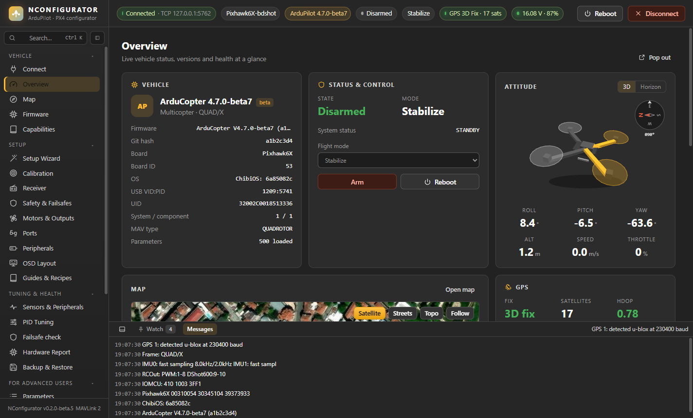
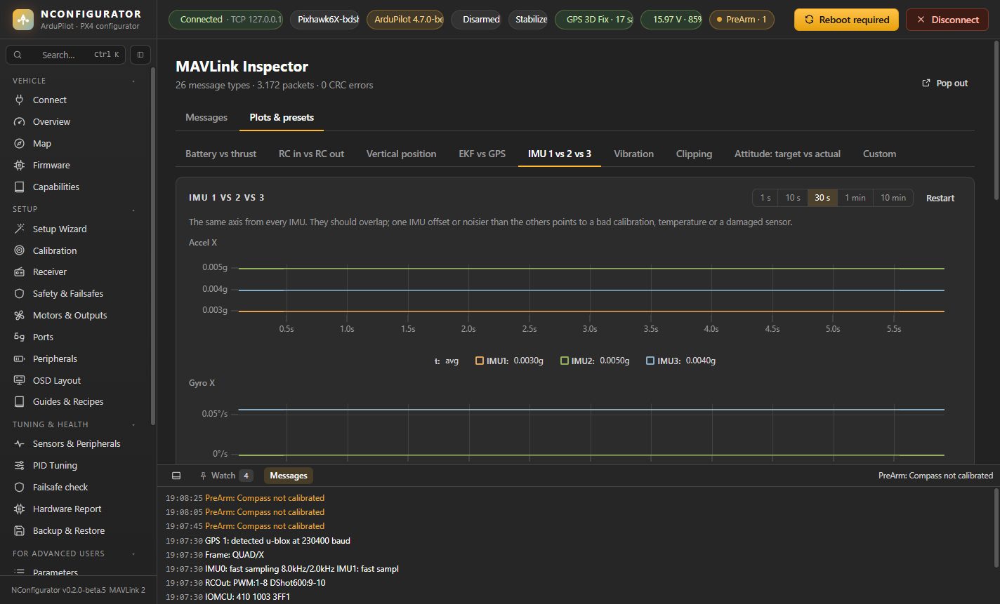
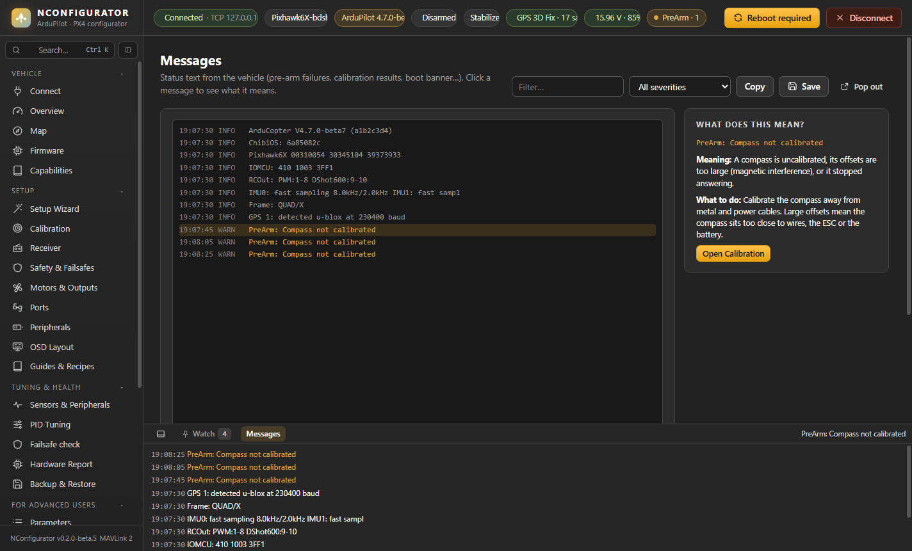
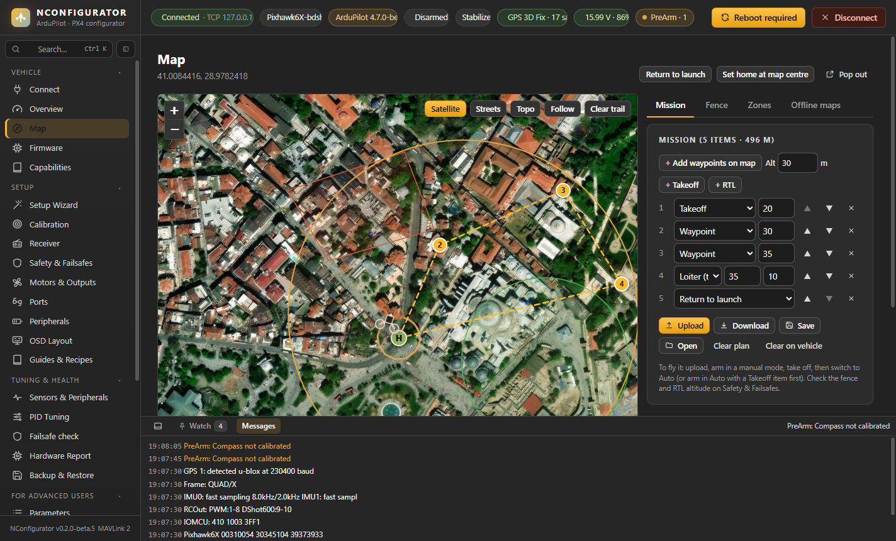
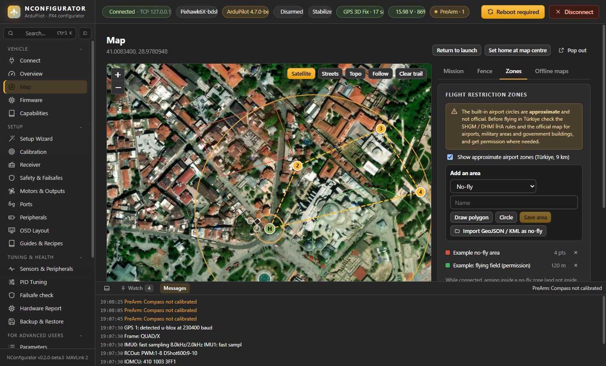
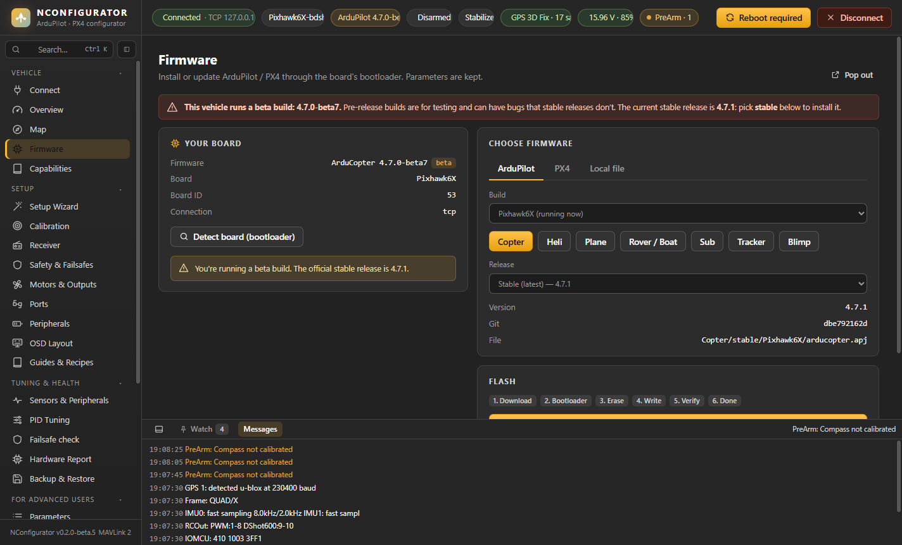

# Vehicle

Pages: **Connect**, **Overview**, **Map**, **Messages**, **MAVLink Inspector**, **Firmware**, **Backup & Restore** (described in Tuning & Health), **Capabilities**. The **MAVLink Console** is described here too; in the sidebar it is under *For Advanced Users*.

## Connect

How to reach the flight controller:

| Link | Use | Notes |
|---|---|---|
| **USB / serial** | Board on USB, or a telemetry radio | Over USB the baud rate doesn't matter. SiK/RFD radios usually use 57600. |
| **UDP** | Simulators, WiFi bridges, MAVProxy outputs | Listens on a local port (14550 by default) and replies to whoever sends. |
| **TCP** | ArduPilot SITL, network links | `127.0.0.1:5760` for SITL on this PC. |

- **Simulator presets** fill in the usual SITL addresses. **Run a simulator…** opens the Simulation page.
- **Recent** reconnects to a link you used before.
- **Auto-connect** (top bar) connects as soon as a flight controller is plugged in. It also reconnects after a reboot or a cable glitch and takes you back to the page you were on.

Flight controllers are listed first, tagged **ArduPilot** or **PX4 / Pixhawk**, then telemetry radios, then other ports.

ArduPilot and PX4 are detected automatically from the heartbeat. The top bar shows the board maker and name (from ArduPilot's firmware server by board ID, or the USB descriptor) and the firmware version; the version chip turns amber with **BETA** or **DEV** for pre-release builds.

## Overview

The vehicle at a glance:

- **Vehicle:** firmware and version (including `-beta` / `-dev`), git hash, board, board ID, OS, USB IDs, MCU unique ID, vehicle type and parameter count.
- **Status & control:** armed state, flight mode (selectable), **Arm** and **Reboot**.
- **Attitude:** the artificial horizon and a live 3D model of the vehicle side by side, with roll, pitch, yaw, altitude, speed and throttle, and a small compass rose with the heading and magnetic north. The 3D view is fixed in the world: turn the vehicle and the model turns the same way.
- **Map**, **GPS** (fix, satellites, HDOP, position), battery and link.
- **Sensor health:** each sensor with its chip name.
- **Ready to fly?** Checks that would block arming or make the first flight unsafe, each with a hint about what to fix.

## Capabilities

### Firmware capabilities

Which features your firmware build contains: scripting, optical flow, OSD, DroneCAN, fence, and more. Missing features you may want link to the custom firmware builder (custom.ardupilot.org).

### Board & device mapping

Serial ports, output functions, and the board's own resource files (UART map, DMA, memory, threads), read from the board over MAVLink FTP.

## MAVLink Inspector

- **Messages:** every message type with its rate and source; field values with units and enum names.
  - **Pin** sends a field to the dock.
  - **+** adds it to the custom plot.
- **Plots & presets** (time window 1 s, 10 s, 30 s, 1 min or 10 min; the page remembers the tab, preset and custom fields):
  - battery vs thrust, RC in vs out, vertical position
  - EKF vs GPS, IMU 1/2/3 (only the IMUs the board has), vibration, clipping
  - attitude target vs actual
  - custom plots

## Messages

- Status messages from the vehicle (PreArm reasons, calibration results, boot banner), filterable by severity, **Copy** (the selected text, or all shown messages) and **Save**.
- **What does this mean?** Click a message: common PreArm, PX4 preflight, EKF, GPS, battery and calibration messages are explained in plain words, with what to do and a button to the page that fixes it.

## MAVLink Console (PX4)

The NuttX shell (nsh) over MAVLink, like QGroundControl's MAVLink Console. Quick commands in three groups:

- **System:** `ver all`, `top once`, `free`, `dmesg`, `work_queue status`, `perf`, `uorb top -1`, `param show -c`, `commander check`
- **Sensors:** `sensors status`, `listener sensor_accel / sensor_gyro / sensor_mag / sensor_baro / sensor_gps / sensor_combined`, `ekf2 status`
- **Power & links:** `listener battery_status`, `listener system_power`, `gps status`, `mavlink status`, `listener input_rc`, `listener actuator_outputs`

Command history with ↑ / ↓, Ctrl+C to interrupt, **Copy** and **Clear**. Commands act immediately and aren't confirmed. ArduPilot has no shell, so the page is hidden there.

## Map

Satellite, street or topographic map with the vehicle (a quadcopter icon turned to its heading), its track, home position and **Follow**. The overlay shows mode, armed state, speed, heading and distance to home.

Header buttons: **Return to launch** (switch the vehicle to RTL) and **Set home at map centre**.

### Mission

- **+ Add waypoints on map**, then click the map; drag a marker to move it. **+ Takeoff** and **+ RTL** add those items.
- Each item: type (Takeoff, Waypoint, Loiter (time), Land, Return to launch), altitude above home, ▲▼ to reorder, × to delete. The title shows the total distance.
- **Upload** / **Download** / **Clear on vehicle**; **Save** and **Open** `.waypoints` files (Mission Planner / QGC format).

### Fence

Draw an inclusion **polygon** (click the corners, **Finish polygon**) or place a **circle**, then **Upload fence**. Enable it on Safety & Failsafes (`FENCE_ENABLE`, and include "polygon" in `FENCE_TYPE`).

### Zones (flight restrictions)

- **Approximate airport zones (Türkiye):** 9 km circles around the main airports. They are **not official**: check the SHGM / DHMİ İHA rules and the official map for airports, military areas and government buildings.
- Add your own **no-fly** areas, or **allowed** areas where you have permission, as a polygon or circle, or import GeoJSON / KML.
- A banner shows when the vehicle is inside a restricted area. Arming inside a no-fly zone (and not inside an allowed area) gives a warning and a voice message. NConfigurator cannot stop the vehicle from arming.

### Offline maps

Every tile you look at is stored on the PC, so places you have seen work without internet. For a field with no network, zoom to it while online and press **Download this area** (Satellite or Topo, up to zoom 19, at most 6000 tiles). OpenStreetMap does not allow bulk downloads, so Streets is only kept as you view it. The panel shows and deletes the stored size.

## Firmware

Installs or updates the firmware through the board's bootloader. **Parameters and calibration are kept.**

1. **Your board.** Usually detected from the connected vehicle (PX4: from `ver hw`, which also pre-selects the matching `.px4` build). A board waiting in its bootloader (no firmware yet, or just reset) is shown when it is plugged in. Otherwise press **Detect board**, which reboots into the bootloader and reads the board ID, or choose the board from the list.
2. **Choose firmware:**
   - **ArduPilot:** vehicle type (Copter, Plane, Rover, Sub, Heli, Tracker, Blimp), release (stable, beta, dev or older) and **Build** for boards with variants, e.g. `Pixhawk6X` or `Pixhawk6X-bdshot` (bi-directional DShot), from the official ArduPilot server.
   - **PX4:** a GitHub release and the target for your board.
   - **Local file:** your own `.apj` or `.px4` file, e.g. a custom build, or a raw `.bin` application image. A `.bin` has no board ID inside, so it can't be checked against the board (you are asked to confirm); a `.bin` that includes the bootloader is refused, flash that one with DFU.
3. **Flash.** The board restarts into the bootloader, the flash is erased, programmed and verified by CRC, then the board reboots and NConfigurator reconnects and opens the **Setup Wizard**.

Notes:

- Don't unplug the board while flashing.
- If the file is for a different board ID, flashing is refused unless you tick **Allow different board ID**. Only do that if you know the targets are compatible.
- Running a beta or dev build? A red banner at the top says so, explains the risk and names the current stable release.
- If the board ID is not on ArduPilot's firmware server (a custom or vendor build), an amber banner says so: get updates from the board maker.
- Boards with Betaflight/INAV or without a bootloader need a DFU flash first, with STM32CubeProgrammer or the `with_bl.hex` file. DFU flashing inside NConfigurator is planned.
