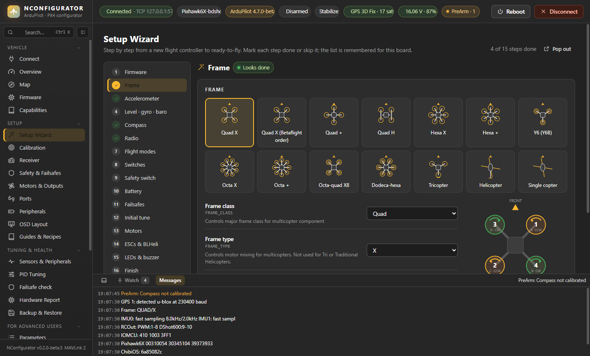
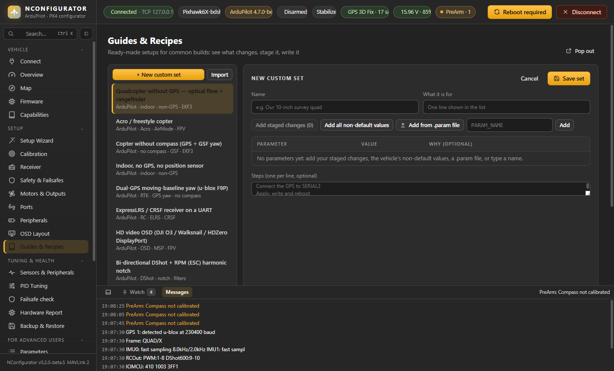
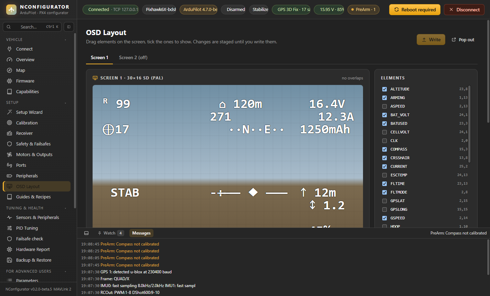

# Setup

Pages: **Setup Wizard**, **Calibration**, **Receiver**, **Safety & Failsafes**, **Motors & Outputs**, **Ports**, **Peripherals**, **OSD Layout** (ArduPilot only), **Guides & Recipes**.

> Propellers off for everything on these pages.

## Setup Wizard

Step by step from a new flight controller to ready-to-fly.

- One **Write** button saves the step's changes; **Mark done** marks it done; **Skip this step** marks it skipped. Visiting a step does not mark it.
- After a firmware flash or a reset to firmware defaults the app opens the wizard by itself when the board reconnects.
- The marks are remembered **per board**, so they survive a reboot or reconnect. **Reset** clears a mark.
- Frame, accelerometer, compass and radio show **Looks done** (✓) when the calibration or setting is already on the vehicle.

| Step | What you do |
|---|---|
| Firmware | Check the version; links to the Firmware page if an update is useful. |
| Frame / airframe | Pick the frame from **pictures**. ArduPilot: quad X / + / H / Betaflight X, hexa, Y6, octa, X8, dodeca-hexa, tricopter, heli, single copter (or set frame class and type by hand), with a diagram showing each output number, its motor-test letter (A, B, C… clockwise from the front) and spin direction. PX4: airframes grouped by type (quad, hexa, octo, coaxial, plane, flying wing, VTOL, rover) or any `SYS_AUTOSTART` number; applied with a reboot, as QGC does. |
| Accelerometer | The same calibration as on the Calibration page. |
| Level · gyro · baro | Level horizon, gyro and baro calibration, and IMU temperature calibration. PX4 has no baro calibration: the step is *Level · gyro* there. |
| Compass | The same calibration as on the Calibration page, plus the **compass priority** when there are two or more. |
| Radio | The same calibration as on the Calibration page. |
| Flight modes | Mode channel and a mode per switch position. |
| Switches | Arm / disarm, emergency stop, arm + emergency stop on one switch, RTL, land, brake, loiter, AutoTune, simple mode, camera, gripper, parachute: press **Assign** and flip the switch you want; the channel is detected (`RCn_OPTION` / PX4 `RC_MAP_*_SW`). **All channel functions (advanced)** opens the full `RCn_OPTION` list. Also on the Receiver page. |
| Safety switch | Whether the board has a hardware safety button and whether it must be pressed before the motors can spin (ArduPilot `BRD_SAFETY_DEFLT` / `BRD_SAFETYOPTION`, PX4 `CBRK_IO_SAFETY`). |
| Battery | Cell count and chemistry first (they fill in the thresholds); how many batteries are monitored (1–3, a tab each); **Edit cell voltages** changes full / low / critical / empty per cell; voltage calibration against a multimeter. |
| Failsafes | **Recommended failsafe settings** (one click), then radio, battery, ground-station and EKF actions. |
| Initial tune | ArduPilot only, marked *only if you know what you are doing*: starting values from prop size, battery and weight (thrust expo, filters, rate PIDs). |
| Motors | Output assignment, **Output test**, motor test, spin direction, idle (`MOT_SPIN_*`). |
| ESCs & BLHeli | ESC protocol (PX4: PWM / OneShot / DShot per output group); passthrough, ESC firmware info and bi-directional DShot appear once motors are assigned (you need the right motor on the right output before reversing it). The extra passthrough mask marks the outputs that are already motors. |
| LEDs & buzzer | Buzzer **On / Off**, type, volume slider and level with **Play test beep**; LED types and what the colours mean. |
| Finish | A list of every step (done, skipped or open, with **Go**) and the arming readiness review with one-click fixes. |

## Calibration

Tabs: **Accelerometer**, **Compass**, **Radio**, **Level · Gyro · Baro**, **ESC**, **Sensor selection & EKF**.

Each tab lists the devices it covers, with chip, bus, location and status, for example:

`Mag 1 · IST8310 · I2C1 0x0E · internal · calibrated` or `IMU 1 · ICM42688 · SPI1 · internal · not calibrated`.

A sensor that isn't detected is named in a yellow box. It can't be calibrated until the autopilot finds it: check the wiring and power, then reboot.

### Accelerometer

Six positions: level, left side down, right side down, nose down, nose up, on its back.

- **ArduPilot:** set the vehicle down on the side shown and leave it. When it has been still on the right side for 4 seconds, the side is saved by itself (normal IMU noise is tolerated); if it moves, the timer waits until it is still again, and a wrong side is named. **Save this side now** does it by hand. (Turn this off in Settings to press **Continue** for each side instead.)
- **PX4:** each side is detected automatically; just hold the vehicle still.

A live 3D model shows how the vehicle is lying, with **FRONT** and **TOP** marked.

Mount the flight controller in the frame first: the calibration also records its alignment.

### Compass

Go away from metal, cars and power cables, then press **Start compass calibration**.

- **Six side tiles** (QGC style, for ArduPilot and PX4): the highlighted tile is the side currently facing down. Its ring fills in 12 steps as you turn the vehicle a full circle with that side down.
- **ArduPilot** accepts any motion, so the tiles are a guide. Each compass also shows a progress bar, its sphere coverage (80 cells) and, at the end, a **fitness** value (lower is better; under 8 mG is good) with its offsets.
- **PX4** decides which sides are done itself; the tiles show its result.
- A live 3D model follows the vehicle in your hands (turn it counter-clockwise and the model turns counter-clockwise).
- **Calibrate:** choose which compasses (ArduPilot). **Fit:** strict / default / relaxed (`COMPASS_CAL_FIT`).
- ArduPilot restarts a failed fit by itself. The panel then shows the attempt number and **why** the last attempt failed (bad orientation, bad radius, offsets, residuals) with what to do. After a failure, **Retry with relaxed fit** is offered.

Reboot after a successful calibration. **Calibration quality** (below the panel) grades the stored result.

### Calibration quality

On the Accelerometer and Compass tabs (and Mag Tools): each device graded good / check / bad from what the calibration produced: offsets, scale, soft-iron terms, motor compensation, live field strength, gyro offsets. Hover a value for what it means.

### Radio — guided calibration

1. **Transmitter mode.** Mode 2 = throttle on the left, the most common. The stick pictures follow your choice.
2. **Centre.** Sticks centred, **throttle fully down**, switches in their normal position. Press **Next**.
3. **Sticks, each end in turn:** throttle max (up), throttle min (down), yaw max (right), yaw min (left), pitch max (forward), pitch min (back), roll max (right), roll min (left). The target in the picture shows where to hold the stick; a step completes when the stick has been held there for a moment.
   - The first end of each stick finds its channel, so any channel order works.
   - It also detects reversed channels.
   - If another channel moves at the same time, it warns about mixing on the transmitter.
4. **All other channels.** Flip every switch through its positions and turn every knob and slider to both ends. Each channel gets a ✓ once it has moved end to end; unused channels can stay unticked.
5. **Mode switch** (optional). Flip the flight-mode switch to assign it, or press **Skip**.
6. **Review.** A table with min / centre / max / reversed per channel. Problems are listed:
   - travel shorter than 600 µs
   - endpoints much narrower than 1000–2000 µs
   - centre far from the middle of the range
   - throttle not down while centring

   Move the sticks: the dots in the stick pictures must follow them in the same direction.
7. **Write calibration.** Shows the list of changed parameters first. **Restore previous** undoes the write.
8. **Test RC loss…** Switch the transmitter off; NConfigurator checks that the autopilot notices the loss. If it doesn't, set the receiver's failsafe to "no pulses".

ArduPilot reads the channel map (`RCMAP_*`) at boot, so reboot afterwards.

### Level · Gyro · Baro

- **Level horizon:** the current attitude becomes "level". Use a flat surface.
- **Gyroscope:** keep the vehicle completely still.
- **Barometer:** sets altitude 0 here.
- **IMU temperature calibration** (ArduPilot): per IMU the `INS_TCALn` state, the learned temperature range (`TMIN`…`TMAX`) and the live temperature, amber when outside the learned range. Learning a new run is for advanced users (tick *I understand the risks*): the card lists the steps (set TMAX, cool the board, **Learn on next boot**, let it warm up without moving it until it saves by itself).

### ESC calibration

For PWM and OneShot ESCs (DShot needs none). **Propellers off.**

- **ArduPilot:** **Arm ESC calibration** sets `ESC_CALIBRATION = 3`. Unplug USB and the battery, connect the battery only, press the safety switch if the board has one, and listen: cell-count beeps, then a long beep. Reconnect and check `ESC_CALIBRATION` is back to 0. **Cancel** clears it.
- **PX4:** battery disconnected, press **Start**, connect the battery when the messages ask.

### Sensor selection & EKF — expert settings

> **If you don't know these settings well, don't change them.** A wrong IMU, EKF lane or compass priority can make the vehicle drift, toilet-bowl, refuse to arm or crash.

The tab starts **locked**. To edit, tick *"I understand…"* and press **Allow changes**; this lasts for the current session.

- **ArduPilot:**
  - **IMUs:** enabled (`INS_ENABLE_MASK`) and used (`INS_USEn`).
  - **EKF3 lanes:** which IMU runs an EKF core (`EK3_IMU_MASK`), with **make primary** (`EK3_PRIMARY`).
  - **Compass priority:** reorder with ▲▼, **remove**, or add a detected compass.
  - **Height & position sources (EKF3):** one click for the vertical source (barometer, rangefinder, GPS, external nav), the primary barometer (with the detected chips), "use rangefinder below x %" (`EK3_RNG_USE_HGT`), and the horizontal position, velocity and yaw sources, with warnings when the chosen source is missing or risky.
  - **Primary GPS** and GPS auto-switch.
  - Warnings appear for an empty IMU mask, a lane on a disabled IMU, or a primary lane that doesn't exist.
- **PX4:** priority per accel / gyro / mag / baro, from *disabled* to *max*, the multi-EKF settings (`EKF2_MULTI_IMU`, `EKF2_MULTI_MAG`), and the height reference and fusion switches (`EKF2_HGT_REF`, `EKF2_*_CTRL`).

## Receiver

- Live channel bars.
- Signal: channel count, RSSI.
- Channel mapping with **Detect** (move a stick to assign it).
- Channel functions and switches (`RCn_OPTION` / PX4 switch mapping).

On PX4, a yellow banner appears until the sticks are mapped; the radio calibration does that.

## Safety & Failsafes

- **What happens when…** A plain-language summary, for example:
  - Radio lost 1 s → RTL
  - Battery critical → Warn only
  - Geofence → disabled
  - Arming checks → all enabled

  Weak settings are marked yellow. **Show live failsafe state** adds the live table: each failsafe's action, trigger, live value and state.
- **Recommended failsafe settings:** for your vehicle type (copter, plane / VTOL, rover, PX4), every setting that differs from a safe starting value, shown as now → recommended: radio loss returns home, low battery returns, critical battery lands, a 120 m cylinder fence, logging. Untick what you want to keep, **Stage**, then **Write**.
- Setting groups:
  - radio loss (failsafe PWM, timeout), battery
  - geofence (start with a simple cylinder: max altitude plus radius; draw polygons on the Map)
  - return & land
  - PX4: data-link loss
  - each card has **Undo** for its own changes since boot; a switched-off fence shows only its on/off setting
  - **For advanced users** (collapsed): ground station / EKF / crash, arming checks, logging (`LOG_*` / `SDLOG_*`), PX4 position loss and failure detector, circuit breakers (`CBRK_*`)

  `CBRK_IO_SAFETY` is normal on boards without a safety button.

## Motors & Outputs

- **Outputs:** live PWM per output, with its function. On boards with an IO co-processor the outputs are named as printed on the board: **MAIN n** (IO) and **AUX n** (FMU).
- **Frame & motor wiring:** a top view of the frame with the output pin each motor is on (e.g. *MAIN 3*) and its spin direction.
- **Motor test:** tick *I have removed the propellers*, set throttle (5 % by default) and duration, then test motor A, B, C… or all in sequence. Letters go clockwise from front-right, in ArduPilot's test order.
- **Manual motor output** (sliders per motor) is for advanced users: tick *I understand the risks* and **Unlock**; it locks again when you leave the page.
- **Output test:** every output pin of the board, one row each (props off, *I understand the risks*, locks again when you leave the page):
  - a motor output: **Spin 2 s**; if another motor spins, pick *which motor spun* and the outputs are re-assigned (swapped) for you
  - an unassigned or free output (gripper, relay, script): a PWM slider
  - a plane: each control surface with what it must do for each stick in MANUAL, and a **Reverse** switch
  - a dead motor, the wrong motor or a servo that doesn't move shows a wiring fault, a dead ESC or a dead PWM channel
- **Output assignment:** a function for each output; **Assign motors** in one step; **Swap two outputs** to fix the motor order without re-soldering; min / trim / max / reversed.
- **IOMCU boards** (Pixhawk, Cube): MAIN outputs come from the IO chip and AUX from the FMU. NConfigurator warns when DShot is selected but the motors are on MAIN; DShot needs FMU outputs unless `BRD_IO_DSHOT = 1`.

## Ports

What is connected to each serial port (GPS, receiver, telemetry, VTX, ESC telemetry, rangefinder…): protocol, baud rate and options. On PX4 this is shown as function → port.

## Peripherals

Tabs:

- **Battery:** monitor type and capacity (more than one battery: Setup Wizard → Battery); voltage and current calibration (enter your multimeter or clamp-meter reading and the multiplier is scaled to match).
- **GPS, Compass, Rangefinder, Airspeed, Optical flow.**
- **OSD & VTX, LEDs & buzzer, Camera & gimbal.**

Only settings that exist in your firmware are shown.

## Guides & Recipes

Ready-made setups for common builds:

- GPS-less quad with optical flow and rangefinder
- acro / AirMode with an arm switch
- flying without a compass (GPS for heading)
- indoor flight
- dual-GPS yaw
- ELRS receiver
- HD OSD
- bi-directional DShot with RPM notch
- safe first-flight defaults
- **tuning scenarios:** ArduCopter AutoTune (switch, axes, aggressiveness, how to save), QuikTune, PX4 auto-tuning, Save Trim for drifting in Stabilize
- PX4 optical flow

Each recipe shows a **now → recipe** table. **Apply to staging** stages only the parameters your firmware has, and lists those that appear after a reboot. Then **Write**.

**Your own sets:** **+ New custom set**, then fill it from your staged changes, all non-default values (calibration and device IDs left out), a `.param` file, or by typing parameter names; add steps if you like. Your sets appear at the top of the list with **Edit set**, **Export to share** (a `.json` file) and **Delete**; **Import** loads a set someone shared.

The optical-flow recipe includes a **live sensor check** and **Set EKF origin** for flying without GPS.

## OSD Layout (ArduPilot)

- Drag OSD elements on the screen: SD 30×16 (PAL) or HD 50×18.
- Tick elements on or off, and switch between OSD screens.
- **Arrow keys** nudge the selected element.
- Overlapping elements are outlined red, and off-screen elements are counted. The horizon, crosshair and sidebars are allowed to overlap.

Changes are staged; press **Write**. The OSD type itself is set in Peripherals → OSD & VTX.
