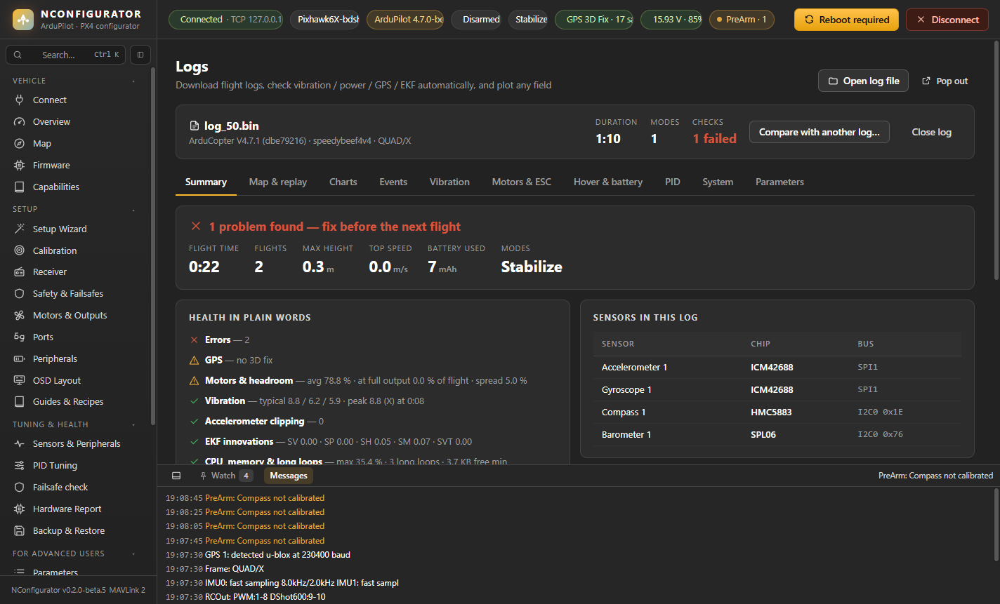
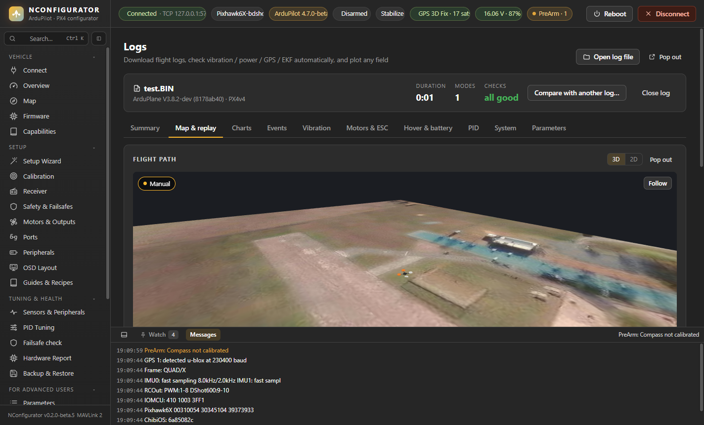

# Tuning & Health

Pages: **Sensors & Peripherals**, **PID Tuning**, **Failsafe check**, **Hardware Report**, **Backup & Restore**. **Mag Tools**, **Parameters** and **Logs** are described here too; in the sidebar they are under *For Advanced Users*.

## Sensors & Peripherals

Live health of everything the autopilot reports:

- **Sensor health:** a tile per sensor with its chip name: green = healthy, red = unhealthy, grey = not present or disabled.
- **Sensor devices:** each IMU, compass, barometer and airspeed sensor with chip, bus (SPI / I2C / DroneCAN), address, device ID and its use or priority. The header names the estimator in use (EKF3 / EKF2 and how many IMU lanes); the **EKF / priority** column shows which EKF lane each IMU feeds and which is primary, IMUs not used by the EKF, the primary baro, and on PX4 each sensor's priority. On PX4 a sensor that is detected but not calibrated yet is listed as such (its chip name appears after calibration).
- **Configured peripherals:** battery monitor, GPS, ESC protocol, OSD, rangefinder, optical flow, CAN, and the serial ports.
- **Live cards**, one row per sensor type with the instances side by side:
  - **IMUs:** IMU 1 | 2 | 3 (accel, gyro, magnetometer, temperature)
  - **GPS:** GPS 1 | 2 (fix, satellites, HDOP, horizontal / vertical / speed accuracy)
  - **Barometers:** Baro 1 | 2 | 3 (pressure, temperature, pressure altitude), airspeed and rangefinder
  - vibration and clipping, EKF variances, board power
  - **System:** CPU load, free memory, internal errors in plain words (SPI / I2C / DMA failures, IO co-processor resets, watchdog, main loop stuck, stack overflow…), comm drops reported by the autopilot, telemetry radio stats, and the MAVLink packet loss measured here
  - DroneCAN nodes

Vibration guide: under 15 m/s² is good, around 30 is a warning, above 60 is bad. Clipping counts should not rise.

## PID Tuning

- Rate-controller gains per axis (P, I, D, FF, filters) next to the firmware defaults.
- **Link roll & pitch** edits both axes together.
- **Response:** a live graph of target against actual rate while you move the sticks (props off) or fly carefully.
- Starting points for a new build come from **Setup Wizard → Initial tune**.

Change one thing at a time and keep a backup.

## Mag Tools

Everything about compasses. Mag Tools is for advanced users: the first time, tick *I understand the risks* and **Unlock** (Settings → **Lock advanced tools again** locks it). For a normal setup the Calibration page is enough.

- **Compass list:**
  - chip and bus, internal/external, live field strength (mG) and heading
  - **Δ** = difference from the EKF heading; more than about 15° usually means a wrong orientation
  - offsets, and whether the compass is used
  - **Primary** / ▲▼ to reorder the priority
  - **Use external only**
  - **Remove from list** for a compass in the priority list that is no longer detected; that one blocks arming
- **Orientation** for each compass.
- **Compass consistency:** angle and strength difference between each pair of compasses. ArduPilot refuses to arm above 90° (3D), 60° (horizontal) or 200 mG. Also shows the EKF compass variance.
- **Motor interference** (live):
  - The field with throttle at 0 is the baseline.
  - The chart shows how far the field vector moves from it as motors and current rise.
  - The table gives the worst change in %, the **mG per amp** (what CompassMot would compensate) and the resulting **heading shift**.
  - Under 30 % is good, 30–60 % is acceptable with CompassMot, above 60 % means move the compass away from the power wiring.
- **Per-motor interference test** (props off): spins each motor alone and measures every compass. The motor, ESC or power lead whose row stands out sits closest to the compass.
- **Large vehicle / fixed-heading calibration** (ArduPilot): point the vehicle at a known true heading and enter it. Needs a 3D GPS fix.
- **Calibration quality** of each compass (see Calibration).
- **CompassMot** (ArduPilot), a guided route in five steps with pictures:
  1. **Why:** how current near the compass bends the heading in flight (toilet-bowling, EKF yaw resets), and when you don't need it.
  2. **Secure:** propellers **on**, vehicle tied down; safer with the props swapped so they push the vehicle down: move each prop one motor on (B's prop to A, A's to D, D's to C, C's to B), as the picture shows.
  3. **Current source:** live current reading; current-based compensation needs a current sensor or ESC telemetry, otherwise throttle-based.
  4. **Run:** throttle up slowly to 50–75 %, hold, back to zero, **Finish**; live chart of throttle, current, voltage and interference.
  5. **Result:** under 30 % good, 30–60 % compensated, above 60 % move the compass. Put the propellers back!

## Failsafe check

After setup, on battery power: each failsafe's setting, the live value and whether it would trigger now; sensor and EKF flags with a timeline of changes.

## Hardware Report

Every sensor and peripheral with its chip, bus, address and calibration state, for example:

- "Compass 2 · BMM150 · I2C bus 3 · 0x10 · internal · not calibrated"
- battery monitor settings, serial ports, CAN, output protocol

Sources: the **connected vehicle**, a `.param` file or a `.bin` log. **Export** saves it as Markdown, handy for forum posts or support.

## Parameters

- **Search** by name or description; **groups** on the left.
- **Filters:**

  | Filter | Shows |
  |---|---|
  | All | every parameter |
  | Edited | your staged, unwritten changes |
  | Modified | values that differ from the firmware default (ArduPilot, with defaults loaded) |
  | Default | values still at the default |
  | Since boot | values changed during this power-up (◆) |

- **Details panel:** description, units, range, default and allowed values or bits. Bitmasks get checkboxes and enums a drop-down. **Pin** sends the parameter to the dock.
- **Load file / Save file:** `.param` files.
- **Reset all to defaults:** asks first; the calibration is lost.

Values the autopilot updates by itself (gyro offsets at boot, ground pressure, statistics) are not counted as changes.

## Backup & Restore

- **Save:** all parameters, or only the non-default ones.
- **Load:**
  - shows every change before it is written
  - category filters
  - **calibration values are skipped by default**, so a backup from another board doesn't overwrite this board's calibration
- **Reset:** **Reset tuning to defaults** (calibration, frame, ports and outputs are kept) or **Reset to firmware defaults** (everything). After a reset the app opens the Setup Wizard when the board reconnects.
- **Automatic backups** are kept on this PC; use **Open folder** to see them.
## Logs

- **Download** flight logs from the vehicle over MAVLink, or open `.bin` (ArduPilot) or `.ulg` (PX4) files.
- **Automatic checks** (click one to plot it):
  - **Vibration:** typical level, the worst peak and when, and time above 30 / 60 m/s² while flying.
  - **Clipping:** how many and when.
  - **GPS:** satellites, HDOP, horizontal and vertical accuracy (HAcc / VAcc).
  - **EKF innovations:** what each test ratio means and which sensor to look at.
  - **CPU, memory & long loops:** with the likely cause of the worst long loop.
  - **Motors & headroom**, power, battery, errors.
- **Tabs:**

  | Tab | Shows |
  |---|---|
  | Summary | Opens first. A verdict (*looks healthy* / *things to look at* / *problems*), flight time, number of flights, max height, distance, top speed, battery used, lowest voltage and modes; every check in plain words (click to plot it); the **sensor chips** in the log (IMU, compass, baro, with bus); and **Suggested changes**: PID changes from oscillation or slow response, a harmonic notch at the measured motor-noise frequency, hover throttle, battery voltage settings for the cell count, compass offsets and motor interference, vibration. Each shows *now → suggested*; with the vehicle connected, **Stage** puts it in the pending list (nothing is written until you press **Write**). |
  | Map & replay | **3D** (default): the flight path over satellite ground, coloured by flight mode at its logged height, with a curtain to the ground and the vehicle at the replay time with its logged attitude; drag to orbit, right-drag to pan, wheel to zoom, **Follow**. **2D**: the path on satellite, street or topo map with start, end and mode-change points. **Pop out** opens the flight view, replay and chart in their own window. **Play** (1×–32×) or drag the slider; click the map to jump there. The charts show the replay time as an orange line, and the 3D attitude and sticks follow it. |
  | Charts | Preset views and free plot. Under each chart: mean / min / max of the visible range (zoom to a range by dragging), **PNG** and **CSV** export. Tick two or more preset charts and **Merge** them into one. Above the charts, **Replay** shows the moment under the cursor: a 3D model of the attitude, both RC sticks, mode, altitude, throttle, speed and battery. |
  | Events | What happened and when, with an explanation: GPS glitches, fix loss and accuracy drops, baro jumps, IMU errors, EKF lane switches and rejected sensors, failsafes, thrust loss, crash, vibration peaks, clipping. Click one to jump the chart to it. |
  | Vibration | Per axis: typical level, peak and when, time above 30 and 60. |
  | Motors & ESC | Per motor: average and maximum output, time at full output, eRPM and eRPM per % output (with ESC telemetry). Notes for a motor working harder, a yaw imbalance between clockwise and counter-clockwise motors, little headroom, or a motor that turns slower for the same command. |
  | Hover & battery | Hover throttle per battery-voltage band (full vs empty pack) and the learned hover value. |
  | PID | Per axis tracking error, lag, overshoot and oscillation from desired vs actual rate, with a suggestion. Needs fast attitude logging for lag and oscillation. |
  | System | CPU load, memory, SPI / I2C counts, internal errors, and each long-loop interval with its likely cause (slow SD card, arming, mode change, CPU, stack). |
  | Parameters | Every parameter stored in the log, searchable, with the **firmware default** and *only changed from default* when the log records defaults (ArduPilot 4.1+, recent PX4). |

- **Compare with another log:** lines from both logs on the same charts, lined up at arming (A and B); a **Compare** tab (columns named by log file) with flight time, height, distance, speed, battery, hover throttle, vibration, motor spread and per-axis tracking error / overshoot, current, power, consumption, max angles, climb and descent rate, GPS, EKF, CPU, long loops, errors and modes side by side with A/B bars and the % change, all checks, and one-click comparison charts (altitude, roll / pitch rate, vibration, battery, throttle, motors); parameter differences; hover throttle of both (with an estimate of the extra weight).
- The open log stays loaded when you go to another page and come back.
- Preset views (11 for ArduPilot, 7 for PX4): battery vs thrust with pack resistance, motor balance, vertical position, EKF2 vs EKF3 vs GPS, IMU 1/2/3, vibration per IMU, clipping, failsafes, attitude, rate PIDs, compass.
