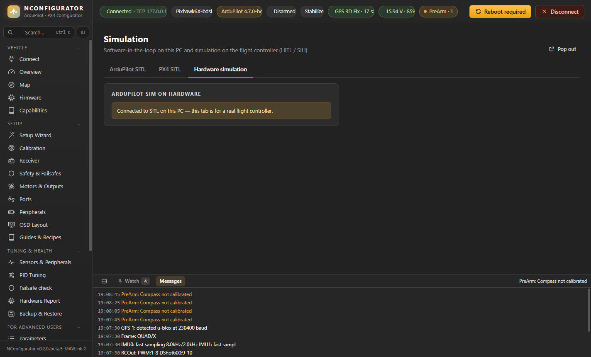

# For Advanced Users & App

Pages: **Filters & Notch**, **Scripts & Files**, **Simulation** (sidebar group *For Advanced Users*: wrong settings here can make a vehicle unflyable; Parameters, Mag Tools, Logs, MAVLink Inspector, Messages and MAVLink Console are in that group too and described on the other pages) and **Settings** (group *App*).

## Filters & Notch

Harmonic notch setup and review, similar to ArduPilot's Filter Review tool:

1. **Current configuration:** gyro low-pass and notch 1/2 with mode, frequency, bandwidth, harmonics and reference.
2. **Guide:** step-by-step setup with ready-made settings for throttle-based, ESC-RPM (bi-directional DShot) and FFT tracking.
3. **Filter review:**
   - Open a log recorded with the batch sampler or raw gyro logging.
   - Look at the gyro spectrum before and after filtering, the notch and low-pass response, the detected noise peaks, and suggestions.
   - Tick **include notch 2** to add the second notch.
4. **Spectrogram:** noise frequency over the whole flight, with the notch line drawn on top. The lowest bright band should sit on the line all the way through. A band drifting away means the tracking mode or reference is wrong.

## Simulation

### ArduPilot SITL on this PC

The real ArduPilot firmware compiled for Windows, with a physics model instead of sensors.

1. Choose the **vehicle** (Copter, Heli, Plane, Rover/boat, Sub), the **frame**, the **firmware** (Stable, Beta, or Latest/dev — the real version is shown next to each), the **home** location and the **speed-up**.
2. Press **Download** once (about 19 MB), then **Start & connect**.
3. Everything in NConfigurator works against the simulated vehicle: setup, failsafe tests, tuning, logs.

Options:

- **Instance 0–3:** run up to four vehicles; TCP ports 5760, 5770, 5780, 5790.
- **Wipe parameters on start:** back to defaults.
- **Extra parameters**, e.g. `SIM_WIND_SPD 5`, `SIM_GPS1_ENABLE 0` (GPS loss), `SIM_ENGINE_MUL 0.7` (weak motor).
- **Real devices in the simulation:** attach a real GPS, receiver, telemetry radio, rangefinder or ESC telemetry on a PC serial port to a simulated serial port. The matching parameters are added at start.

**SITL output** shows the simulator's console.

### PX4 SITL

PX4 SITL runs inside WSL2 (Ubuntu) on Windows. The tab detects WSL, gives the install and run commands to copy, and connects over UDP 14550. The same button works for a simulator on another PC or a virtual machine.

### Hardware simulation

- **PX4 SIH:** the board simulates its own flight.
  - Only available when the firmware contains SIH; F4 boards usually don't.
- **PX4 HITL:** PX4 on the board, fed with sensor data from a simulator on the PC.
- **ArduPilot:** no HITL in standard firmware. Use SITL with real devices, or a "SIM on hardware" custom build.

Both PX4 modes are staged with a warning. **Never fly with `SYS_HITL` set.** Use **Back to normal** to switch off.

## Scripts & Files

- **File manager** for the SD card or storage, over MAVLink FTP: browse, download, upload, delete.
- **Lua scripts** (ArduPilot):
  - Applet library from the ArduPilot repository, from the branch that matches your firmware, with descriptions and one-click install to `/APM/scripts`.
  - Templates and an editor.
  - A scripting guide.
  - Enable scripting first (`SCR_ENABLE`) and reboot.

## Settings

- **Theme:** **Ground station dark** (default) and **Ground station light**, neutral greys like QGroundControl; also Desert sand, Olive night, Steel blue, Sky light and High contrast; text size and font.
- **Colours:** change any colour of the selected theme (background, cards, inputs, borders, text, secondary and dim text, accent, accent 2, OK, warning, error). Lighter and darker shades follow automatically; **×** returns a colour to the theme's own, **Reset all** clears them, **Export / Import** saves a theme as a file to share.
- **Language:** English or Turkish.
- **Voice notifications:** arm/disarm, flight-mode changes, low battery, GPS fix gained/lost, connection/telemetry lost, critical messages, PreArm failures and calibration results — each can be switched on or off.
- **Units** (metric or imperial), **reduce animations**, **lock advanced tools again** (Mag Tools asks for confirmation again), and **reset all settings**.
- **Pop-up notifications** (all, errors only, off), **warning banners** on pages (on/off), and **accelerometer auto-capture** (save each side after 4 s still, ArduPilot).
- **About:** version, licence (MIT) and the pre-release notice.
